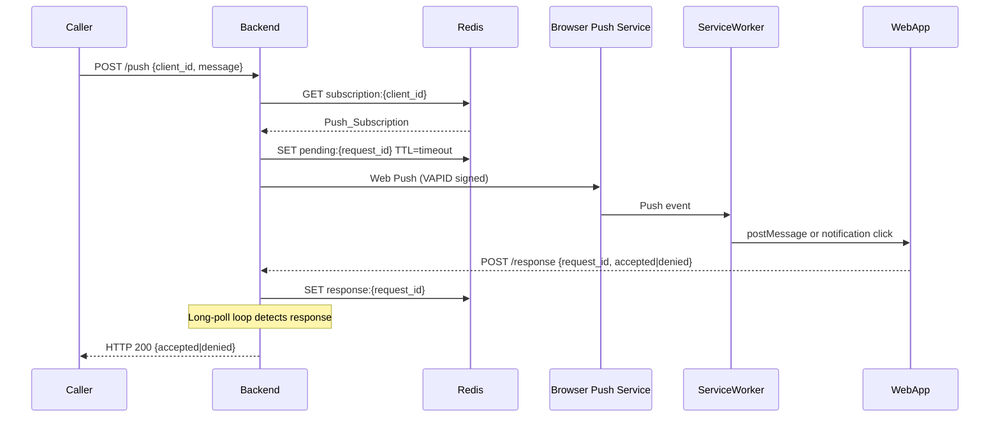
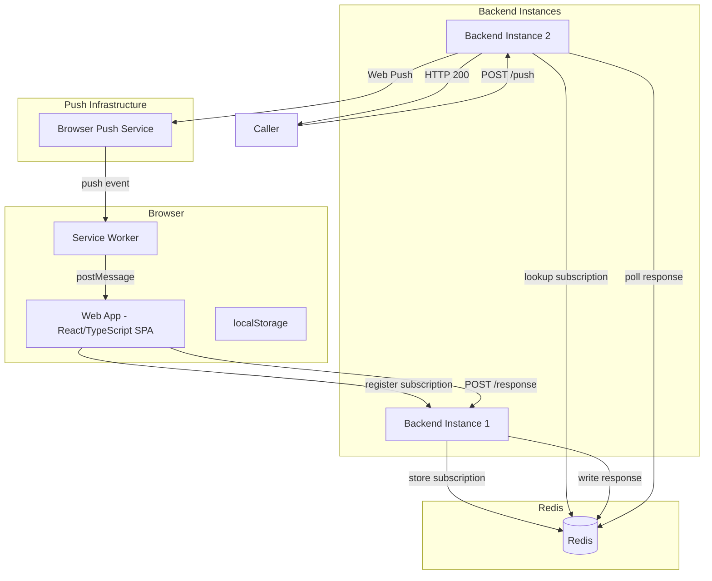

# Design Document: push-mfa-app

## Overview

The push-mfa-app is a push-based Multi-Factor Authentication system. When an external caller triggers an MFA challenge via the `/push` HTTP endpoint, the C# backend looks up the target browser's Web Push subscription in Redis, sends a Web Push notification (VAPID-signed), and holds the caller's connection open via long-polling until the user accepts or denies in the browser. Redis coordinates all state across horizontally scaled backend instances.

Key design goals:
- Stateless backend instances — all coordination through Redis
- Reliable delivery in both foreground and background browser states
- Sequential display of concurrent push requests per client
- Configurable long-poll timeout from backend config

---

## Architecture





---

## Components and Interfaces

### Web App (Browser)

The Web App is a React (TypeScript) Single Page Application (SPA), bundled with Vite. The Service Worker is a plain TypeScript file (not a React component) compiled separately.

**Responsibilities:**
- Prompt for and persist Client_ID in localStorage on first launch
- Register a Service Worker
- Request notification permission and obtain a Push_Subscription from the browser
- POST the Push_Subscription + Client_ID to the backend `/register` endpoint
- Maintain a Push_Queue and display requests sequentially
- Handle foreground push messages via the Service Worker `message` event
- POST accept/deny responses to `/response`

**Key technologies:**
- React 18 + TypeScript — component tree and state management
- Vite — build tooling and dev server
- `navigator.serviceWorker` — registration and messaging
- `PushManager.subscribe()` — obtain Push_Subscription with VAPID public key
- `Notification.requestPermission()` — request OS notification permission
- `localStorage` — persist Client_ID and subscription state

**Service Worker responsibilities:**
- Listen for `push` events and display OS notifications in background state
- On `notificationclick`, focus the Web App tab and `postMessage` the request details
- In foreground state, relay push payload to the Web App via `postMessage` without showing an OS 

### Backend (C#)

**Endpoints:**

| Method | Path                | Description                                           |
| --------| ---------------------| -------------------------------------------------------|
| POST   | `/register`         | Store Client_ID → Push_Subscription mapping in Redis  |
| POST   | `/push`             | Initiate a push MFA challenge; long-poll for response |
| POST   | `/response`         | Receive accept/deny from Web App; write to Redis      |
| GET    | `/vapid-public-key` | Return VAPID public key to Web App for subscription   |

**Key responsibilities:**
- Read `LongPollTimeoutSeconds` from `appsettings.json` at startup
- Load VAPID keys (public key, private key, subject) from PostgreSQL via EF Core on startup (or on first use); cache in memory for the lifetime of the process
- Generate a unique `request_id` (GUID) per push request
- Sign Web Push messages with VAPID private key using a Web Push library (e.g., `WebPush` NuGet package)
- Long-poll by polling Redis for `response:{request_id}` until found or timeout
- Return HTTP 408 on timeout, HTTP 404 if client not found, HTTP 502 on push delivery failure, HTTP 410 on expired request response

**Configuration (`appsettings.json`):**
```json
{
  "LongPollTimeoutSeconds": 60,
  "ConnectionStrings": {
    "Postgres": "Host=localhost;Database=pushmfa;Username=pushmfa;Password=secret",
    "Redis": "localhost:6379"
  }
}
```

> VAPID keys (public key, private key, subject) are **not** stored in `appsettings.json`. They are stored in the `VapidKeys` table in PostgreSQL and loaded by the backend at startup via EF Core.

### Redis Key Schema

| Key Pattern | Type | TTL | Description |
|-------------|------|-----|-------------|
| `subscription:{client_id}` | String (JSON) | None | Push_Subscription for a client |
| `pending:{request_id}` | String | LongPollTimeout | Marks a request as pending |
| `response:{request_id}` | String | LongPollTimeout | Stores `accepted` or `denied` |

---

## Data Models

### Push_Subscription (stored in Redis, JSON)
```json
{
  "endpoint": "https://fcm.googleapis.com/...",
  "keys": {
    "p256dh": "<base64url>",
    "auth": "<base64url>"
  }
}
```

### Push_Request (Web Push payload, JSON)
```json
{
  "request_id": "550e8400-e29b-41d4-a716-446655440000",
  "client_id": "alice-laptop",
  "message": "Login attempt from 192.168.1.1",
  "expires_at": 1700000060
}
```

### POST /register request body
```json
{
  "client_id": "alice-laptop",
  "subscription": { /* Push_Subscription object */ }
}
```

### POST /push request body
```json
{
  "client_id": "alice-laptop",
  "message": "Login attempt from 192.168.1.1"
}
```

### POST /response request body
```json
{
  "request_id": "550e8400-e29b-41d4-a716-446655440000",
  "response": "accepted"
}
```

### POST /push response body (HTTP 200)
```json
{
  "request_id": "550e8400-e29b-41d4-a716-446655440000",
  "response": "accepted"
}
```

### Client_ID localStorage entry
```
Key:   "push_mfa_client_id"
Value: "alice-laptop"
```

### Push_Queue (in-memory, Web App)
An ordered array of `Push_Request` objects. The oldest unresponded request is always displayed first.

---

## VAPID Key Storage (PostgreSQL + EF Core)

VAPID keys are stored in a `VapidKeys` table in PostgreSQL. The backend loads them at startup (or on first use) via EF Core and caches them in memory for the lifetime of the process. They are never written to `appsettings.json`.

### VapidKey Entity

```csharp
public class VapidKey
{
    public int Id { get; set; }           // PK, always 1 (single-row table)
    public string PublicKey { get; set; } // Base64url-encoded VAPID public key
    public string PrivateKey { get; set; }// Base64url-encoded VAPID private key
    public string Subject { get; set; }   // mailto: or https: URI
    public DateTime CreatedAt { get; set; }
}
```

### DbContext

```csharp
public class PushMfaDbContext : DbContext
{
    public PushMfaDbContext(DbContextOptions<PushMfaDbContext> options) : base(options) { }

    public DbSet<VapidKey> VapidKeys { get; set; }

    protected override void OnModelCreating(ModelBuilder modelBuilder)
    {
        modelBuilder.Entity<VapidKey>().HasKey(v => v.Id);
    }
}
```

### Registration (Program.cs)

```csharp
builder.Services.AddDbContext<PushMfaDbContext>(options =>
    options.UseNpgsql(builder.Configuration.GetConnectionString("Postgres")));

builder.Services.AddSingleton<IVapidKeyProvider, VapidKeyProvider>();
```

`VapidKeyProvider` loads the single `VapidKey` row from the DB on first use and caches it:

```csharp
public class VapidKeyProvider : IVapidKeyProvider
{
    private VapidKey? _cached;
    private readonly IServiceScopeFactory _scopeFactory;

    public VapidKeyProvider(IServiceScopeFactory scopeFactory) => _scopeFactory = scopeFactory;

    public async Task<VapidKey> GetAsync()
    {
        if (_cached is not null) return _cached;
        using var scope = _scopeFactory.CreateScope();
        var db = scope.ServiceProvider.GetRequiredService<PushMfaDbContext>();
        _cached = await db.VapidKeys.SingleAsync();
        return _cached;
    }
}
```

### Migration Strategy

1. Add the EF Core migration at development time:
   ```bash
   dotnet ef migrations add InitialVapidKeys
   dotnet ef database update
   ```
2. On first deployment, seed the `VapidKeys` table with a generated key pair. A small CLI tool or startup check can generate and insert the keys if the table is empty:
   ```csharp
   // In Program.cs, after app.Build():
   using (var scope = app.Services.CreateScope())
   {
       var db = scope.ServiceProvider.GetRequiredService<PushMfaDbContext>();
       await db.Database.MigrateAsync(); // apply pending migrations
       if (!await db.VapidKeys.AnyAsync())
       {
           var keys = VapidHelper.GenerateVapidKeys(); // from WebPush NuGet
           db.VapidKeys.Add(new VapidKey {
               Id = 1,
               PublicKey = keys.PublicKey,
               PrivateKey = keys.PrivateKey,
               Subject = "mailto:admin@example.com",
               CreatedAt = DateTime.UtcNow
           });
           await db.SaveChangesAsync();
       }
   }
   ```
3. Key rotation: insert a new row and restart the backend (the singleton cache is invalidated on restart).

---

## Error Handling

### Backend Error Responses

| Condition | HTTP Status | Description |
|-----------|-------------|-------------|
| Client_ID not found in Redis | 404 | `{"error": "client not found"}` |
| Web Push delivery failure | 502 | `{"error": "push delivery failed"}` |
| Long-poll timeout | 408 | `{"error": "request timed out"}` |
| Response for expired request | 410 | `{"error": "request expired"}` |
| Invalid request body | 400 | `{"error": "invalid request"}` |

### Web App Error Handling

- **Notification permission denied**: Show a persistent banner explaining that push notifications are required; do not attempt registration.
- **POST /register failure**: Retry with exponential backoff (3 attempts); show error if all fail.
- **POST /response failure**: Show inline error on the accept/deny UI with a Retry button; keep the request in the Push_Queue.
- **Expired request received**: Display an expiry message instead of accept/deny buttons; remove from queue after acknowledgement.
- **Service Worker registration failure**: Show a warning that background notifications are unavailable; foreground-only mode still works.

### Redis Failure

If Redis is unavailable, the backend should return HTTP 503 for all endpoints that require Redis access. This prevents silent data loss or incorrect responses.


---

## Docker Compose

Docker Compose runs the infrastructure dependencies only. The backend and frontend are started manually by the developer.

```yaml
# docker-compose.yml
services:
  postgres:
    image: postgres:16-alpine
    environment:
      POSTGRES_DB: pushmfa
      POSTGRES_USER: pushmfa
      POSTGRES_PASSWORD: secret
    ports:
      - "5432:5432"
    volumes:
      - postgres_data:/var/lib/postgresql/data

  redis:
    image: redis:7-alpine
    ports:
      - "6379:6379"

volumes:
  postgres_data:
```

Start dependencies:
```bash
docker compose up -d
```

Then run the backend and frontend manually:
```bash
# Backend
cd backend && dotnet run

# Frontend
cd web-app && npm run dev
```

The `appsettings.json` connection strings point to the Docker-hosted services on `localhost`:
```json
{
  "ConnectionStrings": {
    "Postgres": "Host=localhost;Database=pushmfa;Username=pushmfa;Password=secret",
    "Redis": "localhost:6379"
  }
}
```
