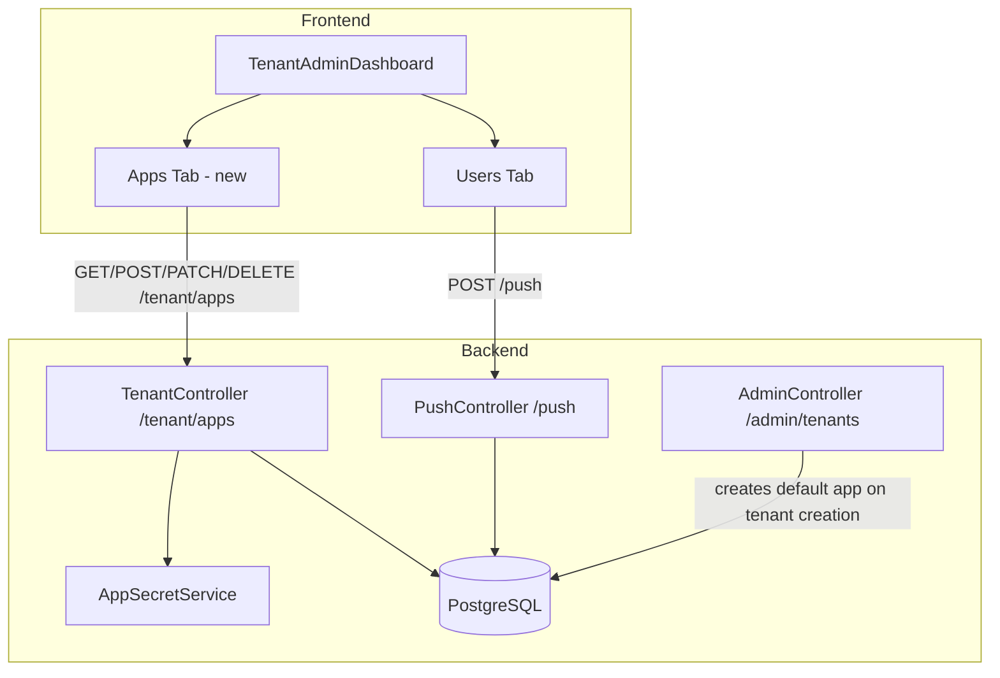

# Design Document: Tenant App Management

## Overview

This feature adds per-tenant app management and app-scoped push MFA authentication. Each tenant owns a collection of named **Apps**, each with a generated secret used to authenticate callers of the `POST /push` endpoint. The existing push MFA flow is extended to require app-based authentication instead of accepting an unauthenticated `userId`. A new "Apps" tab is added to the Tenant Admin Dashboard for CRUD management of apps, and a "Simulate Push" action is added to the Users tab using the tenant's default app.

The design follows the existing patterns in the codebase: EF Core + PostgreSQL for persistence, JWT-authenticated ASP.NET Core controllers, and React/TypeScript with `apiClient` for the frontend.

---

## Architecture



The push endpoint changes from accepting a `userId` to accepting `tenantId + username + appId` with a Bearer app-secret. The backend resolves the user from the tenant+username pair after authenticating the app.

---

## Components and Interfaces

### Backend

#### `TenantApp` entity (`backend/Data/TenantApp.cs`)

New EF Core entity mapped to the `TenantApps` table.

#### `AppSecretService` (`backend/Services/AppSecretService.cs`)

Stateless service with a single method for generating cryptographically random 32-character alphanumeric secrets. Used by `TenantController` and `AdminController`.

#### `TenantController` — new `/tenant/apps` endpoints

Added to the existing `TenantController`, all under `[Authorize(Roles = "TenantAdmin")]`:

| Method | Route | Description |
|--------|-------|-------------|
| GET | `/tenant/apps` | List all apps for the caller's tenant (secret excluded) |
| POST | `/tenant/apps` | Create a new app; returns full record including secret |
| PATCH | `/tenant/apps/{appId}` | Update name and/or isDisabled |
| DELETE | `/tenant/apps/{appId}` | Delete app (blocked for default app) |
| POST | `/tenant/apps/{appId}/reset-secret` | Regenerate and return new secret |

#### `AdminController` — default app provisioning

`POST /admin/tenants` is updated to also create a default app for the new tenant within the same transaction.

#### `PushController` — updated `POST /push`

The existing `PushRequest` model is replaced. The new request body accepts `tenantId`, `username`, and `appId`. Authentication is via `Authorization: Bearer <app-secret>` header. The legacy `userId` field is removed.

#### `PushMfaDbContext` — updated

`TenantApps` `DbSet` added; `OnModelCreating` updated with the unique constraint on `(TenantId, Name)` and the FK to `Tenants`.

#### EF Core Migrations

Two new migrations:
1. Schema migration — adds `TenantApps` table.
2. Data migration — seeds a default app for every existing tenant that lacks one.

---

### Frontend

#### `TenantAdminDashboard.tsx` — tabbed layout

The page is refactored to render two tabs: **Users** (existing content, unchanged) and **Apps** (new). Tab state is local (`useState`).

#### Apps tab UI

- Lists all apps with columns: Name, Default, Status, Created, Actions.
- "New App" form: name input + submit. On success, shows the generated secret in a highlighted one-time display with a copy button and a "will not be shown again" warning.
- Per-app actions: Reset Secret (shows new secret the same way), Enable/Disable toggle, Delete (with `window.confirm`). Delete on the default app shows an inline error.

#### Users tab — Simulate Push

Each user row gains a "Simulate Push" button. Clicking it calls `POST /push` with the default app's `appId` and secret (fetched alongside the apps list). The result (accepted / denied / timed out / error) is shown inline next to the user row.

#### API calls (via `apiClient`)

```
GET    /tenant/apps
POST   /tenant/apps                        { name }
PATCH  /tenant/apps/:appId                 { name?, isDisabled? }
DELETE /tenant/apps/:appId
POST   /tenant/apps/:appId/reset-secret
POST   /push                               { tenantId, username, appId } + Authorization header
```

---

## Data Models

### `TenantApp` (new table: `TenantApps`)

```csharp
public class TenantApp
{
    public Guid Id { get; set; }
    public Guid TenantId { get; set; }
    public Tenant Tenant { get; set; } = null!;
    public string Name { get; set; } = string.Empty;      // unique per tenant
    public string Secret { get; set; } = string.Empty;    // plain-text opaque token, 32 alphanumeric chars
    public bool IsDisabled { get; set; } = false;
    public bool IsDefault { get; set; } = false;
    public DateTime CreatedAt { get; set; }
}
```

Constraints (in `OnModelCreating`):
- Unique index on `(TenantId, Name)`.
- FK `TenantId → Tenants.Id` with cascade delete.

### `Tenant` (updated)

```csharp
public ICollection<TenantApp> Apps { get; set; } = new List<TenantApp>();
```

### Updated `PushRequest` DTO

```csharp
public class PushRequest
{
    public Guid TenantId { get; set; }
    public string Username { get; set; } = string.Empty;
    public Guid AppId { get; set; }
    // Legacy UserId field removed
}
```

### API response shapes

**GET /tenant/apps** — array of:
```json
{ "id": "uuid", "name": "string", "isDefault": true, "isDisabled": false, "createdAt": "iso8601" }
```

**POST /tenant/apps** / **POST /tenant/apps/{id}/reset-secret** — includes secret:
```json
{ "id": "uuid", "name": "string", "isDefault": false, "isDisabled": false, "createdAt": "iso8601", "secret": "32charstring" }
```

---

## Error Handling

### Backend

| Scenario | HTTP Status | Error body |
|----------|-------------|------------|
| Missing/malformed `Authorization` header on `/push` | 401 | `{ "error": "unauthorized" }` |
| `appId` not found in tenant | 401 | `{ "error": "unauthorized" }` |
| Bearer token doesn't match app secret | 401 | `{ "error": "unauthorized" }` |
| App is disabled | 403 | `{ "error": "app_disabled" }` |
| Username not found in tenant | 404 | `{ "error": "user_not_found" }` |
| No push subscription for user | 404 | `{ "error": "device_not_found" }` |
| Duplicate app name within tenant | 409 | `{ "error": "app_name_already_exists" }` |
| Delete attempted on default app | 409 | `{ "error": "cannot_delete_default_app" }` |
| App belongs to different tenant (PATCH/DELETE/reset-secret) | 403 | `{ "error": "forbidden" }` |
| Unauthenticated request to `/tenant/apps` | 401 | (JWT middleware) |

All 401 responses for app authentication use the same generic message to avoid leaking whether the appId exists.

### Frontend

- All API errors are caught and displayed as inline `alert alert-error` messages near the relevant action.
- The one-time secret display (on create and reset-secret) is rendered in a distinct highlighted box with a copy button. Once the user navigates away or closes the panel, the secret is gone from state.
- Simulate Push shows a status badge inline on the user row: "Accepted", "Denied", "Timed out", or an error message.
- Attempting to delete the default app shows an inline error without a confirm dialog (the backend will reject it anyway, but the frontend can also guard against it by checking `isDefault`).
