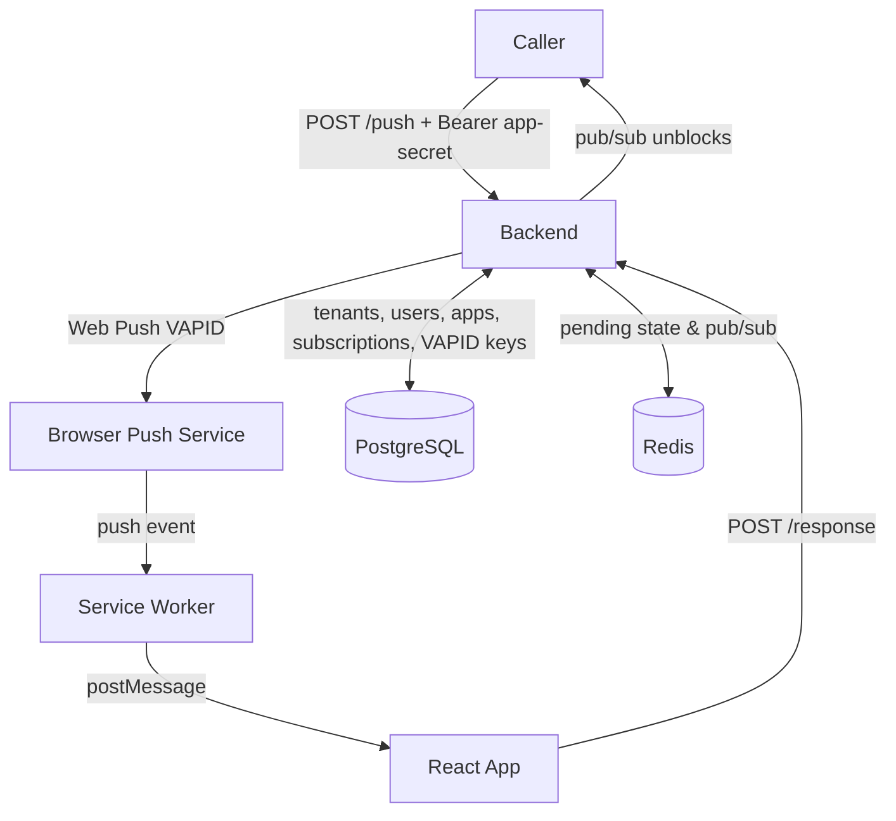
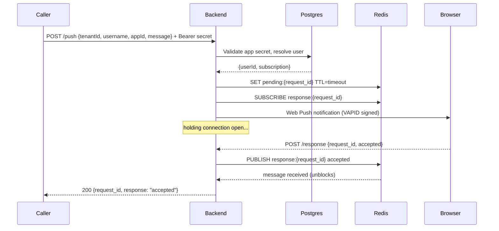
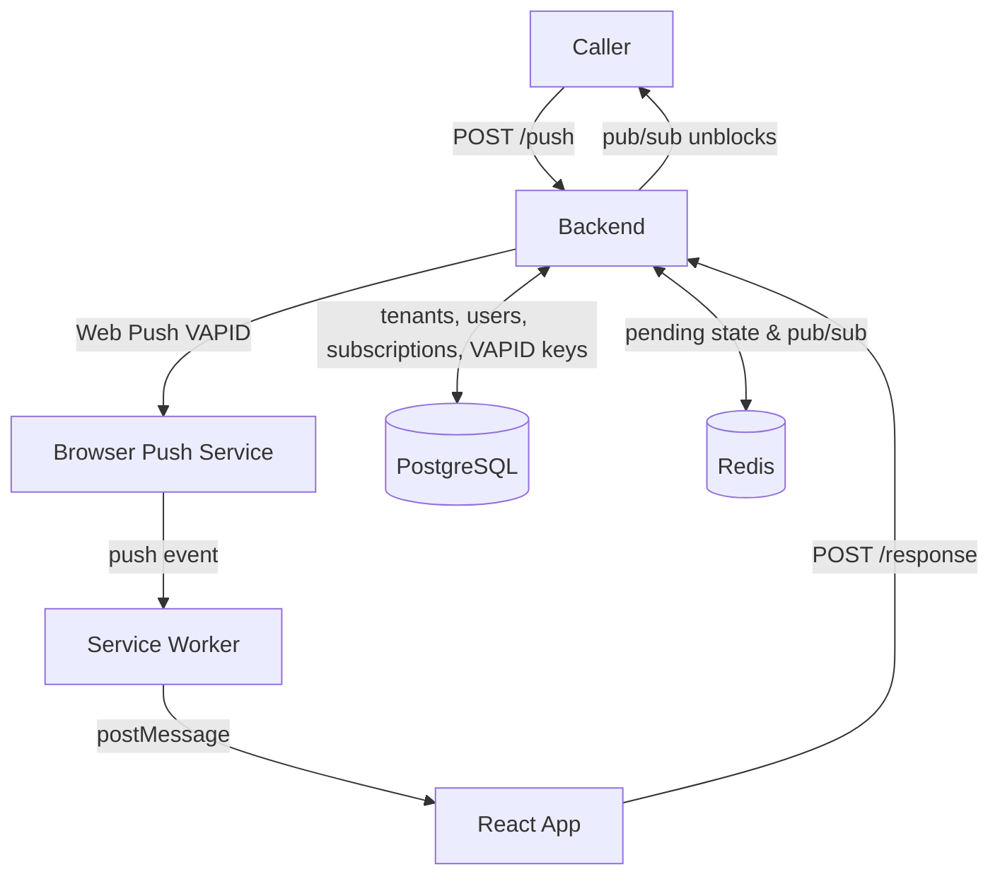
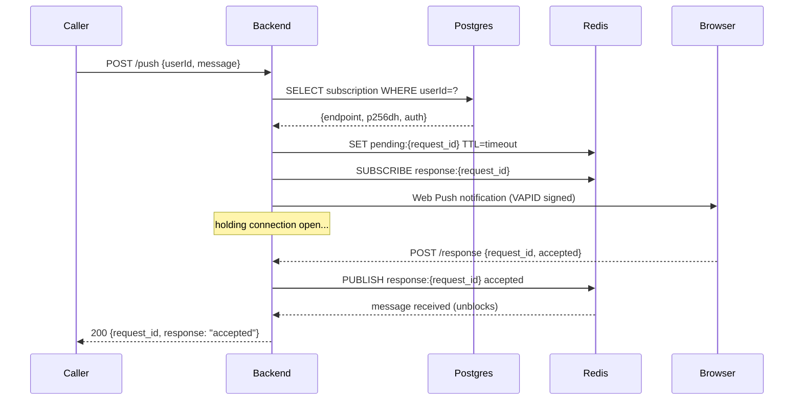

# Push MFA App

A push-based Multi-Factor Authentication system with multi-tenant support. When an external caller triggers an MFA challenge, the backend sends a Web Push notification to the user's registered browser. The user accepts or denies directly in the app, and the response is returned synchronously to the caller.

## Architecture



## Request flow



## Stack

| Layer | Technology |
|-------|-----------|
| Frontend | React 18 + TypeScript + Vite |
| Push delivery | Web Push API + Service Worker |
| Backend | ASP.NET Core (.NET 7) |
| Database | PostgreSQL (tenants, users, apps, VAPID keys, push subscriptions) |
| Cache / pub-sub | Redis |

## Multi-tenant model

The system supports multiple isolated tenants. Each tenant has its own domain, users, apps, and optional login instructions.

| Role | Capabilities |
|------|-------------|
| `SuperAdmin` | Manage tenants (create, disable/enable); manage all tenant users |
| `TenantAdmin` | Manage users and apps within their tenant; configure login instructions; simulate push; use MFA |
| `TenantUser` | Register push device; respond to MFA challenges |

- Tenants are identified by a unique **domain** (e.g. `acme-corp`)
- Users log in via a two-step flow: enter tenant domain → enter credentials
- Direct URL login is supported: `/login/<tenant-domain>`
- Disabled tenants block all logins for that tenant
- Disabled users cannot log in

## App-based authentication

Each tenant owns one or more **Apps**. An App is identified by a UUID `appId` and authenticated by a 32-character alphanumeric secret. The `/push` endpoint requires callers to present a valid `appId` and matching `Authorization: Bearer <secret>` header.

- Every tenant is provisioned with a **Default App** at creation time (and backfilled for existing tenants)
- The Default App is used internally by the Tenant Admin dashboard to simulate push notifications — its secret never needs to be exposed to the frontend
- Non-default apps can be created, renamed, disabled, deleted, and have their secrets reset from the Tenant Admin dashboard
- A disabled app is rejected at the `/push` endpoint with HTTP 403

## Project structure

```
├── backend/
│   ├── Controllers/
│   │   ├── AdminController.cs      # SuperAdmin: tenant + user management
│   │   ├── AuthController.cs       # /auth/login, /auth/tenant/{domain}
│   │   ├── PushController.cs       # /register, /push, /response
│   │   ├── TenantController.cs     # TenantAdmin: users, apps, simulate-push
│   │   └── VapidController.cs      # /vapid-public-key
│   ├── Data/
│   │   ├── PushMfaDbContext.cs
│   │   ├── Tenant.cs
│   │   ├── TenantApp.cs
│   │   ├── User.cs
│   │   ├── VapidKey.cs
│   │   └── PushSubscriptionEntity.cs
│   ├── Services/
│   │   ├── AppSecretService.cs     # Cryptographically random 32-char secret generation
│   │   ├── AuthService.cs          # JWT login, disabled checks
│   │   └── VapidKeyProvider.cs
│   ├── Migrations/
│   ├── appsettings.json
│   └── Program.cs
├── web-app/
│   ├── public/
│   │   └── sw.js                   # Service Worker
│   └── src/
│       ├── api/
│       │   └── apiClient.ts
│       ├── components/
│       │   ├── ProtectedRoute.tsx
│       │   ├── PushRequestView.tsx
│       │   ├── NotificationBanner.tsx
│       │   └── ThemeToggle.tsx
│       ├── context/
│       │   ├── AuthContext.tsx
│       │   └── ThemeContext.tsx
│       ├── hooks/
│       │   ├── usePushQueue.ts
│       │   └── usePushRegistration.ts
│       ├── pages/
│       │   ├── LoginPage.tsx           # Two-step tenant + credentials login
│       │   ├── SuperAdminLoginPage.tsx
│       │   ├── SuperAdminDashboard.tsx
│       │   ├── TenantAdminDashboard.tsx  # Users + Apps tabs, Simulate Push
│       │   └── MfaApp.tsx
│       └── App.tsx
└── docker-compose.yml
```

## Prerequisites

- [.NET 7 SDK](https://dotnet.microsoft.com/download/dotnet/7.0)
- [Node.js 18+](https://nodejs.org)
- [Docker](https://www.docker.com)

## Running with Docker (recommended)

```bash
docker compose up --build
```

| Service | URL |
|---------|-----|
| Web app | `http://localhost:8080` |
| Backend API | `http://localhost:5000` |

The backend applies EF Core migrations and seeds VAPID keys automatically on first start. To override the API URL the frontend calls (e.g. for a custom domain):

```bash
VITE_API_BASE_URL=https://api.example.com docker compose up --build
```

## Running locally (without Docker)

**1. Start infrastructure (Postgres + Redis)**

```bash
docker compose up -d postgres redis
```

**2. Run the backend**

```bash
cd backend
dotnet run
```

On first run, EF Core automatically applies migrations and seeds VAPID keys into Postgres.

Backend runs at `http://localhost:5000`.

**3. Run the frontend**

```bash
cd web-app
npm install
npm run dev
```

Frontend runs at `http://localhost:5173`.

**4. Create a SuperAdmin**

The SuperAdmin account must be seeded directly in the database (no public registration endpoint):

```sql
INSERT INTO "Users" ("Id", "TenantId", "Username", "PasswordHash", "Role", "CreatedAt")
VALUES (gen_random_uuid(), NULL, 'superadmin', '<bcrypt-hash>', 'SuperAdmin', now());
```

**5. Open the app**

| URL | Description |
|-----|-------------|
| `http://localhost:5173/admin/login` | SuperAdmin login |
| `http://localhost:5173/login` | Tenant user/admin login |
| `http://localhost:5173/login/<domain>` | Direct login for a specific tenant |

## Sending a push challenge

Callers must authenticate using an app secret. Retrieve the `appId` and secret from the Tenant Admin dashboard (Apps tab).

```bash
curl -X POST http://localhost:5000/push \
  -H "Content-Type: application/json" \
  -H "Authorization: Bearer <app-secret>" \
  -d '{
    "tenantId": "<tenant-uuid>",
    "username": "<username>",
    "appId": "<app-uuid>",
    "message": "Login attempt from Chrome on macOS"
  }'
```

The request blocks until the user accepts or denies in the browser, then returns:

```json
{ "request_id": "...", "response": "accepted" }
```

Timeout returns HTTP 408.

## API reference

### Auth

| Method | Path | Auth | Description |
|--------|------|------|-------------|
| `POST` | `/auth/login` | — | Login; returns JWT |
| `GET` | `/auth/tenant/{domain}` | — | Resolve tenant by domain |

### Push

| Method | Path | Auth | Description |
|--------|------|------|-------------|
| `GET` | `/vapid-public-key` | — | VAPID public key for push subscription |
| `GET` | `/register/status` | TenantUser, TenantAdmin | Check if device is registered |
| `POST` | `/register` | TenantUser, TenantAdmin | Register browser push subscription |
| `POST` | `/push` | Bearer app-secret | Send MFA challenge; long-polls for response |
| `POST` | `/response` | — | Submit accept/deny from browser |

### Tenant admin

| Method | Path | Auth | Description |
|--------|------|------|-------------|
| `GET` | `/tenant/info` | TenantAdmin | Get tenant name, domain, login instructions |
| `PUT` | `/tenant/instructions` | TenantAdmin | Update login instructions |
| `GET` | `/tenant/users` | TenantAdmin | List users in tenant |
| `POST` | `/tenant/users` | TenantAdmin | Create user |
| `DELETE` | `/tenant/users/{id}` | TenantAdmin | Delete user |
| `PATCH` | `/tenant/users/{id}/disable` | TenantAdmin | Disable user |
| `PATCH` | `/tenant/users/{id}/enable` | TenantAdmin | Enable user |
| `POST` | `/tenant/users/{id}/reset-password` | TenantAdmin | Reset user password |
| `POST` | `/tenant/simulate-push/{userId}` | TenantAdmin | Simulate push via default app |
| `GET` | `/tenant/apps` | TenantAdmin | List apps (secrets excluded) |
| `POST` | `/tenant/apps` | TenantAdmin | Create app; returns secret once |
| `PATCH` | `/tenant/apps/{id}` | TenantAdmin | Update app name / disabled state |
| `DELETE` | `/tenant/apps/{id}` | TenantAdmin | Delete app (blocked for default app) |
| `POST` | `/tenant/apps/{id}/reset-secret` | TenantAdmin | Regenerate app secret; returns new secret once |

### Super admin

| Method | Path | Auth | Description |
|--------|------|------|-------------|
| `GET` | `/admin/tenants` | SuperAdmin | List all tenants |
| `POST` | `/admin/tenants` | SuperAdmin | Create tenant (also creates default app) |
| `PATCH` | `/admin/tenants/{id}/disable` | SuperAdmin | Disable tenant |
| `PATCH` | `/admin/tenants/{id}/enable` | SuperAdmin | Enable tenant |
| `GET` | `/admin/tenants/{id}/users` | SuperAdmin | List users in tenant |
| `POST` | `/admin/tenants/{id}/admins` | SuperAdmin | Create tenant admin |
| `PATCH` | `/admin/tenants/{id}/users/{uid}/disable` | SuperAdmin | Disable tenant user |
| `PATCH` | `/admin/tenants/{id}/users/{uid}/enable` | SuperAdmin | Enable tenant user |
| `DELETE` | `/admin/tenants/{id}/users/{uid}` | SuperAdmin | Delete tenant user |

## Configuration

`backend/appsettings.json`:

```json
{
  "LongPollTimeoutSeconds": 60,
  "Jwt": {
    "Key": "<secret>",
    "Issuer": "pushmfa",
    "Audience": "pushmfa",
    "ExpiryHours": 8
  },
  "ConnectionStrings": {
    "Postgres": "Host=localhost;Database=pushmfa;Username=pushmfa;Password=secret",
    "Redis": "localhost:6379"
  }
}
```

`web-app/.env`:

```
VITE_API_BASE_URL=http://localhost:5000
```

## Horizontal scaling

All state lives in Redis and Postgres — backend instances are stateless. Run multiple backend instances behind a load balancer; Redis pub/sub ensures the instance holding the long-poll connection receives the response regardless of which instance processed `/response`.


## Architecture



## Request flow



## Stack

| Layer | Technology |
|-------|-----------|
| Frontend | React 18 + TypeScript + Vite |
| Push delivery | Web Push API + Service Worker |
| Backend | ASP.NET Core (.NET 7) |
| Database | PostgreSQL (tenants, users, VAPID keys, push subscriptions) |
| Cache / pub-sub | Redis |

## Multi-tenant model

The system supports multiple isolated tenants. Each tenant has its own domain, users, and optional login instructions.

| Role | Capabilities |
|------|-------------|
| `SuperAdmin` | Manage tenants (create, disable/enable); manage all tenant users |
| `TenantAdmin` | Manage users within their tenant; configure login instructions; use MFA |
| `TenantUser` | Register push device; respond to MFA challenges |

- Tenants are identified by a unique **domain** (e.g. `acme-corp`)
- Users log in via a two-step flow: enter tenant domain → enter credentials
- Direct URL login is supported: `/login/<tenant-domain>`
- Disabled tenants block all logins for that tenant
- Disabled users cannot log in (shown as "Your account has been disabled")
- A push subscription endpoint is exclusive to one user — re-registering the same device from a different account removes the previous binding

## Project structure

```
├── backend/
│   ├── Controllers/
│   │   ├── AdminController.cs      # SuperAdmin: tenant + user management
│   │   ├── AuthController.cs       # /auth/login, /auth/tenant/{domain}
│   │   ├── PushController.cs       # /register, /push, /response
│   │   ├── TenantController.cs     # TenantAdmin: user management, login instructions
│   │   └── VapidController.cs      # /vapid-public-key
│   ├── Data/
│   │   ├── PushMfaDbContext.cs
│   │   ├── Tenant.cs
│   │   ├── User.cs
│   │   ├── VapidKey.cs
│   │   └── PushSubscriptionEntity.cs
│   ├── Services/
│   │   ├── AuthService.cs          # JWT login, disabled checks
│   │   └── VapidKeyProvider.cs
│   ├── Migrations/
│   ├── appsettings.json
│   └── Program.cs
├── web-app/
│   ├── public/
│   │   └── sw.js                   # Service Worker
│   └── src/
│       ├── api/
│       │   └── apiClient.ts
│       ├── components/
│       │   ├── ProtectedRoute.tsx
│       │   ├── PushRequestView.tsx
│       │   ├── NotificationBanner.tsx
│       │   └── ThemeToggle.tsx
│       ├── context/
│       │   ├── AuthContext.tsx
│       │   └── ThemeContext.tsx
│       ├── hooks/
│       │   ├── usePushQueue.ts
│       │   └── usePushRegistration.ts
│       ├── pages/
│       │   ├── LoginPage.tsx           # Two-step tenant + credentials login
│       │   ├── SuperAdminLoginPage.tsx
│       │   ├── SuperAdminDashboard.tsx
│       │   ├── TenantAdminDashboard.tsx
│       │   └── MfaApp.tsx
│       └── App.tsx
└── docker-compose.yml
```

## Prerequisites

- [.NET 7 SDK](https://dotnet.microsoft.com/download/dotnet/7.0)
- [Node.js 18+](https://nodejs.org)
- [Docker](https://www.docker.com)

## Running with Docker (recommended)

```bash
docker compose up --build
```

| Service | URL |
|---------|-----|
| Web app | `http://localhost:8080` |
| Backend API | `http://localhost:5000` |

The backend applies EF Core migrations and seeds VAPID keys automatically on first start. To override the API URL the frontend calls (e.g. for a custom domain):

```bash
VITE_API_BASE_URL=https://api.example.com docker compose up --build
```

## Running locally (without Docker)

**1. Start infrastructure (Postgres + Redis)**

```bash
docker compose up -d postgres redis
```

**2. Run the backend**

```bash
cd backend
dotnet run
```

On first run, EF Core automatically applies migrations and seeds VAPID keys into Postgres.

Backend runs at `http://localhost:5000`.

**3. Run the frontend**

```bash
cd web-app
npm install
npm run dev
```

Frontend runs at `http://localhost:5173`.

**4. Create a SuperAdmin**

The SuperAdmin account must be seeded directly in the database (no public registration endpoint):

```sql
INSERT INTO "Users" ("Id", "TenantId", "Username", "PasswordHash", "Role", "CreatedAt")
VALUES (gen_random_uuid(), NULL, 'superadmin', '<bcrypt-hash>', 'SuperAdmin', now());
```

**5. Open the app**

| URL | Description |
|-----|-------------|
| `http://localhost:5173/admin/login` | SuperAdmin login |
| `http://localhost:5173/login` | Tenant user/admin login |
| `http://localhost:5173/login/<domain>` | Direct login for a specific tenant |

## Sending a push challenge

```bash
curl -X POST http://localhost:5000/push \
  -H "Content-Type: application/json" \
  -d '{"userId": "<user-uuid>", "tenantId": "<tenant-uuid>", "message": "Login attempt from 192.168.1.1"}'
```

The request blocks until the user accepts or denies in the browser, then returns:

```json
{ "request_id": "...", "response": "accepted" }
```

Timeout returns HTTP 408.

## API reference

### Auth

| Method | Path | Auth | Description |
|--------|------|------|-------------|
| `POST` | `/auth/login` | — | Login; returns JWT |
| `GET` | `/auth/tenant/{domain}` | — | Resolve tenant by domain |

### Push

| Method | Path | Auth | Description |
|--------|------|------|-------------|
| `GET` | `/vapid-public-key` | — | VAPID public key for push subscription |
| `GET` | `/register/status` | TenantUser, TenantAdmin | Check if device is registered |
| `POST` | `/register` | TenantUser, TenantAdmin | Register browser push subscription |
| `POST` | `/push` | — | Send MFA challenge; long-polls for response |
| `POST` | `/response` | — | Submit accept/deny from browser |

### Tenant admin

| Method | Path | Auth | Description |
|--------|------|------|-------------|
| `GET` | `/tenant/info` | TenantAdmin | Get tenant name, domain, login instructions |
| `PUT` | `/tenant/instructions` | TenantAdmin | Update login instructions |
| `GET` | `/tenant/users` | TenantAdmin | List users in tenant |
| `POST` | `/tenant/users` | TenantAdmin | Create user |
| `DELETE` | `/tenant/users/{id}` | TenantAdmin | Delete user |
| `PATCH` | `/tenant/users/{id}/disable` | TenantAdmin | Disable user |
| `PATCH` | `/tenant/users/{id}/enable` | TenantAdmin | Enable user |
| `POST` | `/tenant/users/{id}/reset-password` | TenantAdmin | Reset user password |

### Super admin

| Method | Path | Auth | Description |
|--------|------|------|-------------|
| `GET` | `/admin/tenants` | SuperAdmin | List all tenants |
| `POST` | `/admin/tenants` | SuperAdmin | Create tenant |
| `PATCH` | `/admin/tenants/{id}/disable` | SuperAdmin | Disable tenant |
| `PATCH` | `/admin/tenants/{id}/enable` | SuperAdmin | Enable tenant |
| `GET` | `/admin/tenants/{id}/users` | SuperAdmin | List users in tenant |
| `POST` | `/admin/tenants/{id}/admins` | SuperAdmin | Create tenant admin |
| `PATCH` | `/admin/tenants/{id}/users/{uid}/disable` | SuperAdmin | Disable tenant user |
| `PATCH` | `/admin/tenants/{id}/users/{uid}/enable` | SuperAdmin | Enable tenant user |
| `DELETE` | `/admin/tenants/{id}/users/{uid}` | SuperAdmin | Delete tenant user |

## Configuration

`backend/appsettings.json`:

```json
{
  "LongPollTimeoutSeconds": 60,
  "Jwt": {
    "Key": "<secret>",
    "Issuer": "pushmfa",
    "Audience": "pushmfa",
    "ExpiryHours": 8
  },
  "ConnectionStrings": {
    "Postgres": "Host=localhost;Database=pushmfa;Username=pushmfa;Password=secret",
    "Redis": "localhost:6379"
  }
}
```

`web-app/.env`:

```
VITE_API_BASE_URL=http://localhost:5000
```

## Horizontal scaling

All state lives in Redis and Postgres — backend instances are stateless. Run multiple backend instances behind a load balancer; Redis pub/sub ensures the instance holding the long-poll connection receives the response regardless of which instance processed `/response`.
